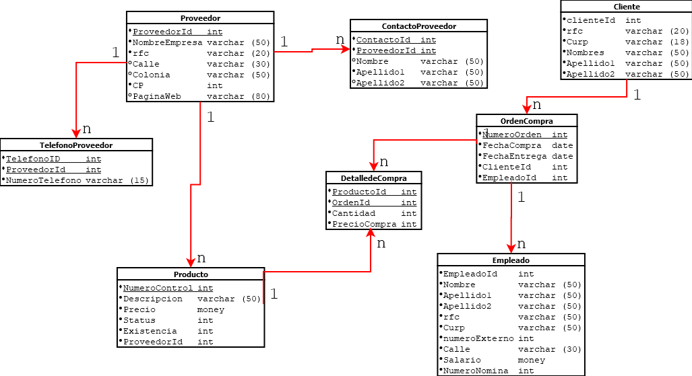

# Requerimientos

Una empresa encargada de las ventas de diferentes productos desea crear una base de datos que controles los proveedores, clientes, empleados, categorías de producto y órdenes de compra. Para los proveedores se necesita almacenar un numero de control, nombre de la empresa, dirección (numero, calle, colonia, estado), cp,teléfono, página web, teléfono de contacto o contactos del proveedor, nombre del contacto, email del contacto. Para los empleados se desea almacenar un numero de nómina, nombre completo del empleado, rfc, curp, salario (El salario máximo es de 65000), para las ordenes de compra se necesita almacenar la fecha de creación de la orden, el empleado que la realizo, al cliente que se le vende, la fecha de entrega y los diferentes productos que contiene. El producto debe almacenar un numero de control y una descripción única, status, existencia y un precio. La categoría debe tener un identificador y nombre único de categoría. La compra siempre debe tener un precio de venta que se obtiene del precio unitario del producto y una cantidad vendida.

# Diagrama E/R

# Diagrama Relacional



# Creacion BD con Lenguaje SQL-LDD 

``` sql
create database bdVentas;
use bdVentas

create table cliente (
clienteId int not null identity(1,1),
rfc varchar(20) not null,
curp varchar(18) not null,
nombres varchar(50) not null,
Apellido1 varchar(50) not null,
Apellido2 varchar (50) not null,

constraint pk_cliente
primary key(clienteId),
constraint unico_rfc
unique (rfc),
constraint unico_curp
unique (curp)
);

create table contactoProveedor (
contactoId int not null identity (1,1),
proveedorId int not null,
nombre varchar(50) not null,
Apellido1 varchar(50) not null,
Apellido2 varchar(50) not null,
constraint  pk_contactoProveedor
primary key (contactoId)
);

create table Proveedor(
proveedorId int not null identity (1,1),
nombreEmpresa varchar(20) not null,
rfc varchar (20),
calle varchar(30)not null,
colonia varchar(50)not null,
cp int not null,
paginaWeb varchar(50),

constraint pk_Proveedor
primary key (proveedorId),
constraint unico_nombreEmpresa
unique (nombreEmpresa),
constraint unico_rfc2
unique (rfc),
);

alter table contactoProveedor
add constraint fk_contactoProveedor_proveedor
foreign key (proveedorId)
references proveedor(proveedorId);

create table empleado(
empleadoId int not null identity (1,1),
nombre varchar(50) not null,
apellido1 varchar (50) not null,
apellido2 varchar(50) not null,
rfc varchar (20) not null,
curp varchar (18) not null,
numeroexterno int,
calle varchar (50) not null,
salario money not null,
numeronomina int not null,

constraint pk_Empleado
primary key (empleadoId),
constraint unico_rfc_empleado
unique(rfc),
constraint unico_curp_empleado
unique(curp),
constraint chk_salario
check (salario>=0.0 and salario <=100000),
--check (salario between 0.1 and 100000)
constraint unico_nomina_empleado
unique (numeronomina)
);

create table telefonoProveedor(
telefonoId int not null,
proveedorId int not null,
numerodetelefono varchar(15),

constraint pk_telefono_proveedor
primary key(telefonoId,proveedorId),
constraint fk_telefonoprov_proveedor
foreign key (proveedorId)
references proveedor(proveedorId)
on delete cascade
on update cascade
);

create table producto (
numerocontrol int not null identity(1,1),
descripcion varchar(50)not null,
precio money not null,
estatus int not null,
existencia int not null,
proveedorid int not null ,
constraint pk_producto
primary key(numerocontrol),
constraint unico_descripcion
unique(descripcion),
constraint chk_precio
check(precio between 1 and 200000),
constraint chk_estatus
check(estatus=1 or estatus=0),
constraint chk_existencia
check(existencia>0),
constraint fk_producto_proveedor
foreign key (proveedorid)
references proveedor(proveedorId)
);

create table ordencompra(
numeroorden int not null identity,
fechacompra date not null,
fechaentrega date not null,
clienteid int not null,
empleadoid int not null,
constraint pk_ordencompra
primary key(numeroorden),
constraint fk_ordencompra_cliente
foreign key (clienteid)
references cliente(clienteId),
constraint fk_ordencompra_empleado
foreign key(empleadoid)
references empleado(empleadoId),
);

create table detalleCompra(
productoId int not null,
numeroorden int not null,
cantidad int not null,
preciocompra money not null,
constraint pk_detallecompra
primary key (productoId, numeroorden),
constraint fk_ordencompra_producto
foreign key(productoId)
references producto (numerocontrol),
constraint fk_ordencompra_compra
foreign key (numeroorden)
references ordencompra (numeroorden)
)
```

```sql
# Llenar base de datos con lenguaje SQL-LMD
use [bdVentas];

select * from Northwind.dbo.Customers --Nort(nombre de bd), dbo(esquemas), cutomers (tabla)

go
select * from cliente
go

--Insertar en la tabla cliente

insert into cliente(rfc,curp,nombres,Apellido1,Apellido2)
values ('klhg19830406x9j', 'SACR041017HMCNRDA1', 'Alfreds Futterkiste','Perez','Futterkiste'),
('jlhg19830406x9z', 'JLHG19880416', 'Ana Trujillo Emparedados y helados','Perez','Futterkiste'),
('jlhg19830406x9d', 'JLHG19880496', 'Ana Trujillo Emparedados y helados','Perez','Futterkiste'),
('jlhg19830406x9f', 'JLHG19880436', 'Ana Trujillo Emparedados y helados','Perez','Futterkiste'),
('jlhg19830406x9k', 'JLHG19880456', 'Ana Trujillo Emparedados y helados','Perez','Futterkiste');

select * from cliente

delete cliente

DBCC CHECKIDENT (cliente, RESEED,0) --Reiniciar el identity

select top 0 EmployeeID as 'EmpleadoId' ,LastName as 'Segundo Nombre',FirstName as 'Primer nombre', BirthDate as 'Fecha de nacimiento', HireDate as 'Fecha Contratacion',
[address] as 'Direccion', City as 'City', Region, PostalCode as 'Codigo Postal', Country as 'Pais'
into empleado2
from Northwind.dbo.Employees

--Insertar datos a partir de una consulta

select *  from empleado2

alter table empleado2
add constraint pk_empleado2
primary key (empleadoid)

insert into empleado2 (EmpleadoId,[Segundo Nombre],[Primer nombre],[Fecha de nacimiento],[Fecha Contratacion],Direccion,City,Region,[Codigo Postal],Pais)
select EmployeeID as 'EmpleadoId' ,LastName as 'Segundo Nombre',FirstName as 'Primer nombre', BirthDate as 'Fecha de nacimiento', HireDate as 'Fecha Contratacion',
[address] as 'Direccion', City as 'City', Region, PostalCode as 'Codigo Postal', Country as 'Pais'


select top 5* from Northwind.dbo.[Order Details]--TOP es para mostrar los primeros 5 resultados
order by OrderID desc --Ordena de ultimo a primero


```